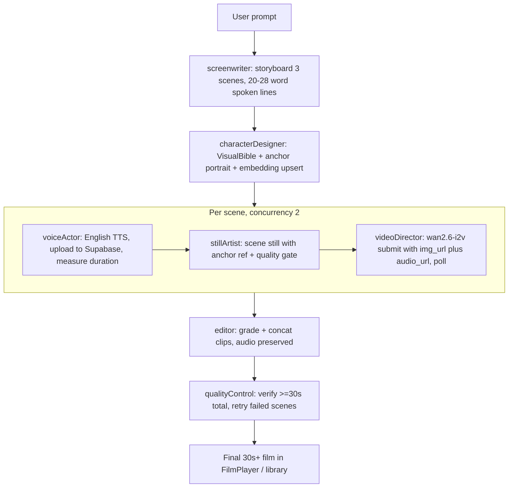

# 30+ Second Character-Consistent Video Pipeline (LangGraph JS)

## Model strategy (my choice, per your go-ahead)

- Primary video model: `**wan2.6-i2v**` on DashScope International (Singapore) — accepts `img_url` (identity anchor still) + `audio_url` (English TTS voice) and generates a clip with **phoneme-level lip-sync**, audio embedded, duration 2–15s, 720P/1080P, 30fps H.264. Fallback: `wan2.6-i2v-flash`, last resort `wan2.2-i2v-plus` (silent clip + overlaid voice, current behavior).
- Duration plan: **3 scenes x 11s = 33s** (each scene duration = TTS audio length + ~1.5s padding, clamped 6–15s; total re-checked to stay >= 30s).
- Character consistency: one canonical **character anchor portrait** (Qwen-Image) generated once, injected as a high-weight reference into every scene still; every clip is i2v from its still so identity comes from pixels, not text. Existing continuity system (character locks, `CONTINUITY_NEGATIVE_PROMPT`, pgvector 0.82 similarity gate in [src/lib/continuity.ts](src/lib/continuity.ts) and [src/lib/quality-gate.ts](src/lib/quality-gate.ts)) is reused as-is.
- Constraint handled: `audio_url` must be a public HTTPS URL (data URLs not accepted for audio), so TTS output gets uploaded to the existing public Supabase `website-assets` bucket via the admin client; that host is already on the SSRF allowlist in [src/lib/qwen.functions.ts](src/lib/qwen.functions.ts).

## Architecture

LangGraph runs **in the browser** (`@langchain/langgraph/web` — the agent route is already `ssr: false`), with graph nodes calling the existing authenticated server functions. This avoids Cloudflare Worker execution-time limits since video jobs take minutes and are polled client-side (same as today).

## Changes by file

### 1. Dependencies — [package.json](package.json)

Add `@langchain/langgraph` and `@langchain/core` (latest via npm).

### 2. Long-form limits — [src/lib/makers-runtime.ts](src/lib/makers-runtime.ts)

Add `LONGFORM_LIMITS` alongside `MAKERS_DEMO_LIMITS`: 3 scenes, 6–15s per scene (default 11), min total 30s / max 45s, `maxParallelVideoJobs: 2`, poll attempts raised to ~90 (wan2.6 10s+audio jobs take 5–10 min).

### 3. Server functions — [src/lib/qwen.functions.ts](src/lib/qwen.functions.ts)

- `**submitVideo**`: extend model enum with `wan2.6-i2v` / `wan2.6-i2v-flash`; add optional `audioUrl`, `durationSeconds` (2–15), `resolution` ("720P"/"1080P", default 720P). For wan2.6 models send `parameters: { resolution, duration, prompt_extend: true, watermark: false }` and `input: { prompt, img_url, audio_url }` instead of the legacy `size` param. Poll endpoint unchanged.
- `**generateStoryboard**`: parameterize the currently hardcoded "under 15 seconds" demo constraints — accept a `mode: "demo" | "longform"` input; longform prompts ask for 3 scenes of ~~11s each with 20–28 word English `spoken_line`s (~~8–9s of speech), same character in every scene, dialogue written for on-camera delivery.
- **New `uploadVoiceAudio`** server fn: takes base64 MP3 (from `generateVoice`'s data URL), uploads to `website-assets/voice/{projectId}/{sceneId}.mp3` via the existing admin client ([src/integrations/supabase/client.server.ts](src/integrations/supabase/client.server.ts)), returns the public URL.

### 4. New LangGraph orchestrator — `src/lib/longform-graph.ts` (new file)

`StateGraph` built from `@langchain/langgraph/web`. State: prompt, storyboard, visual bible, anchor image URL, per-scene records (audioUrl, audioSeconds, stillUrl, videoUrl, similarity, trace), final film URL, errors. Nodes:

- **screenwriter** — `generateStoryboard` (longform mode) + `validateAndRepairScenes` + `buildShortFilmVisualBible`.
- **characterDesigner** — generate one front-facing anchor portrait via `generateSceneImage` using the full character lock from the bible; `upsertCharacterEmbedding`.
- **voiceActor** (per scene) — `generateVoice` (English, gender/age-matched voice from the bible's voice pool) → `uploadVoiceAudio` → decode duration client-side via `AudioContext.decodeAudioData` → scene duration = `clamp(ceil(audioSec) + 2, 6, 15)`.
- **stillArtist** (per scene) — scene still with anchor image as reference (weight >= 0.85) through the existing `generateSceneWithQualityGate` + `scoreSceneAgainstCharacter`; one regen if similarity < 0.82.
- **videoDirector** (per scene) — `submitVideo` with `wan2.6-i2v`, `img_url` = still, `audio_url` = voice URL, duration, lip-sync prompt (reuse `buildOptimizedScenePrompt` / `formatSceneContinuity`); poll with fallback chain wan2.6-i2v → wan2.6-i2v-flash → wan2.2-i2v-plus (silent + overlay flag).
- **editor** — `gradeClip` + `concatClips` (clips carry embedded voice audio; concat `-c copy` preserves it since all wan2.6 output is uniform H.264/AAC 30fps).
- **qualityControl** — assert total duration >= 30s; conditional edge back to videoDirector for a failed/short scene (max 1 retry each).
Progress is streamed to the UI via a callback the route passes in (graph `streamMode: "updates"`).

### 5. Agent workspace — [src/routes/dashboard_.agent.$id.tsx](src/routes/dashboard_.agent.$id.tsx)

- Replace the ~450-line imperative `runPipeline` body with an invocation of the longform graph, mapping node updates to the existing `cards` / `tasks` / `messages` state (UI look stays the same).
- `FilmPlayer`: skip the separate `audioUrl` overlay for clips with embedded audio (wan2.6 clips) to avoid double voice; keep overlay only for silent-fallback clips.
- Update duration copy (15s demo wording → 30s+).

### 6. Config — [.env.example](.env.example)

Add `QWEN_LONGFORM_VIDEO_MODEL=wan2.6-i2v`, `QWEN_LONGFORM_VIDEO_FALLBACK_MODEL=wan2.6-i2v-flash`, `QWEN_VIDEO_RESOLUTION=720P`, `LONGFORM_MAX_TOTAL_SECONDS=45`.

## Notes and risks

- Your DashScope key must have `wan2.6-i2v` enabled on the International endpoint; the graph's fallback chain degrades gracefully if not.
- 720P default keeps cost sane (1080P roughly doubles it); ~33s of wan2.6-i2v per run.
- Scene transitions stay as prompt-engineered match cuts (existing `cut_in`/`cut_out` logic) with hard concat — browser-side crossfades via ffmpeg.wasm xfade are possible later but heavy.
- Lovable constraint respected: incremental commits, no history rewrites, branch stays working.

