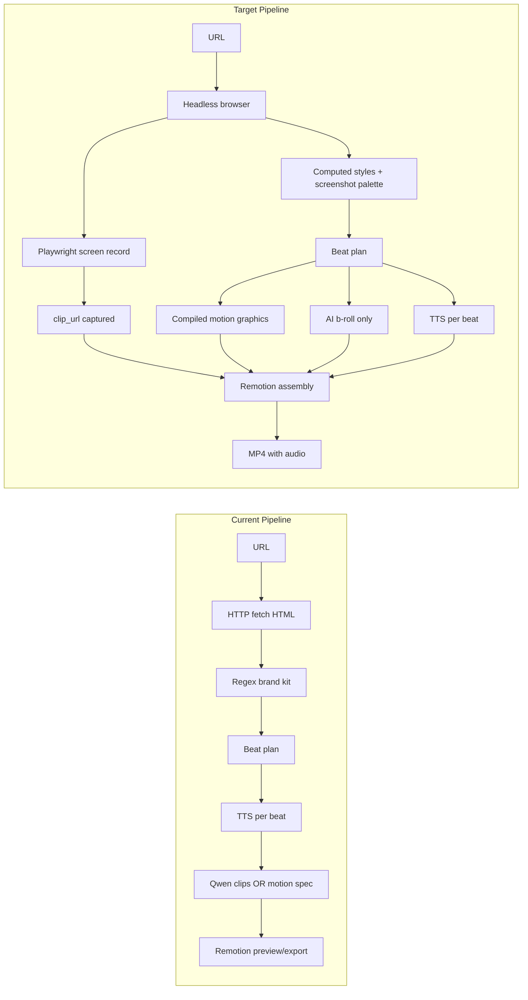
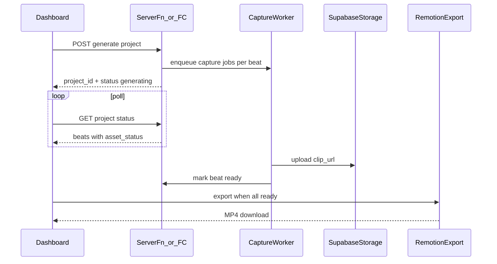

# Website-to-Video Deep Implementation Plan + Supabase Lovable Prompt

## What you want vs what exists today

**Target experience:** Paste a URL → the system visits the site, extracts logo/colors/fonts/copy, screen-records real UI flows, generates supporting clips, voices each beat, and exports a polished 3–4 minute video that looks like the brand.

**Today (`[dashboard_.website.tsx](f:\qwen-showrunner-magic\src\routes\dashboard_.website.tsx)`):** The flow *looks* complete in the UI but several core steps are simulated:


| Capability                                      | Status                                                       | Where                                                                                                                                                                                             |
| ----------------------------------------------- | ------------------------------------------------------------ | ------------------------------------------------------------------------------------------------------------------------------------------------------------------------------------------------- |
| URL → brand kit (name, colors, fonts, logo URL) | Partial — HTML regex only, no browser                        | `[website-video.ts](f:\qwen-showrunner-magic\src\lib\website-video.ts)`                                                                                                                           |
| Screen capture / screen recording               | **Not implemented** — choreography JSON only                 | `[website-render-pipeline.ts](f:\qwen-showrunner-magic\src\lib\website-render-pipeline.ts)`                                                                                                       |
| `screen_capture` beats                          | Misrouted to Qwen AI video, not real site footage            | `[website-video-clips.ts](f:\qwen-showrunner-magic\src\lib\website-video-clips.ts)`                                                                                                               |
| Logo/colors/fonts in visuals                    | Extracted but **not rendered** (hardcoded Georgia/system-ui) | `[motion-graphic-renderer.tsx](f:\qwen-showrunner-magic\src\components\motion-graphic-renderer.tsx)`                                                                                              |
| Beat preview + export                           | Working — Remotion timeline + MP4 (WebCodecs)                | `[website-main-composition.tsx](f:\qwen-showrunner-magic\src\remotion\website-main-composition.tsx)`, `[website-remotion-export.ts](f:\qwen-showrunner-magic\src\lib\website-remotion-export.ts)` |
| Blocked sites (403)                             | Working — motion fallback + badges                           | `[website-site-resilience.ts](f:\qwen-showrunner-magic\src\lib\website-site-resilience.ts)`                                                                                                       |
| Voice (incl. Indian langs)                      | Working — Sarvam + localization critique                     | `[qwen.functions.ts](f:\qwen-showrunner-magic\src\lib\qwen.functions.ts)`, `[tts-routing.ts](f:\qwen-showrunner-magic\src\lib\tts-routing.ts)`                                                    |





---

## Phase 1 — Real brand extraction (logo, colors, fonts)

**Goal:** Brand kit reflects what the site actually looks like, not regex guesses.

### 1.1 Headless page load service

Add a server-side capture worker (cannot run on Cloudflare Workers — use one of):

- **Option A (recommended):** Extend `[deploy/](f:\qwen-showrunner-magic\deploy)` Alibaba FC with a `POST /api/website/extract` route (Node + Playwright, 2GB RAM, 120s+ timeout per `[deploy/s.yaml](f:\qwen-showrunner-magic\deploy\s.yaml)`)
- **Option B:** Separate always-on Node worker (Railway/Fly) called from TanStack server functions

**New file:** `src/lib/website-browser-extract.ts`

```typescript
// Returns: screenshot buffer, computed palette, font families, logo candidates, nav links, meta
export async function extractSiteInBrowser(url: string): Promise<BrowserExtractResult>
```

**Playwright steps:**

- Launch Chromium with real viewport (1440×900), browser User-Agent (reuse `[BROWSER_UA](f:\qwen-showrunner-magic\src\lib\website-site-resilience.ts)`)
- `goto` with `networkidle`, detect 403/429 → return `blocked: true` (reuse `[classifyFetchFailure](f:\qwen-showrunner-magic\src\lib\website-site-resilience.ts)`)
- `page.evaluate()` for: `document.title`, meta tags, computed `fontFamily` on `h1,h2,p,button`, dominant colors from `getComputedStyle` on header/hero, logo `img` src (resolve relative URLs)
- Screenshot hero (upload to Supabase Storage or temp OSS → return HTTPS URL)
- Optional: Vibrant/node-vibrant on screenshot for palette confirmation

### 1.2 Wire into brand kit

Update `[extractWebsiteBrandKit](f:\qwen-showrunner-magic\src\lib\website-video.ts)` to:

1. Try browser extract first
2. Fall back to current HTML fetch + `[fetchBasicMetaFallback](f:\qwen-showrunner-magic\src\lib\website-site-resilience.ts)`
3. Fall back to `[buildFallbackBrandKit](f:\qwen-showrunner-magic\src\lib\website-video.ts)`

**Schema additions** on `WebsiteBrandKit`:

- `hero_screenshot_url?: string`
- `extraction_method: "browser" | "fetch" | "fallback"`
- `font_urls?: string[]` (Google Fonts links if detected)

### 1.3 Render brand faithfully

Update `[MotionGraphicRenderer](f:\qwen-showrunner-magic\src\components\motion-graphic-renderer.tsx)` and `[website-beat-composition.tsx](f:\qwen-showrunner-magic\src\remotion\website-beat-composition.tsx)`:

- Load `heading_typeface` / `body_typeface` via `@font-face` or Google Fonts `<link>` in Remotion root
- Render `logo_asset_path` as `` in `logo_moment` / `cta_card` layouts
- Use extracted hex values for CSS variables (`--primary`, `--accent`, etc.) — stop hardcoding Georgia/system-ui

**Acceptance:** Beat preview shows real logo image + site fonts + extracted palette on a motion_graphic beat.

---

## Phase 2 — Real screen capture (the biggest gap)

**Goal:** `production_method: "screen_capture"` produces a real `.webm`/`.mp4` of the site UI, tagged `asset_source: "captured"`.

### 2.1 Capture executor

**New file:** `src/lib/website-screen-capture.ts`

Implement the contract already defined in `[compileCaptureChoreography](f:\qwen-showrunner-magic\src\lib\website-render-pipeline.ts)`:

```typescript
export async function captureBeat(
  spec: CaptureChoreography,
  outputDir: string
): Promise<{ clip_path: string; duration_seconds: number }>
```

**Playwright recording:**

```typescript
const context = await browser.newContext({
  viewport: spec.viewport,
  recordVideo: { dir: outputDir, size: spec.viewport },
});
// execute interaction_sequence: wait:N, scroll:N, hover:selector, click:selector
await context.close(); // finalizes video file
```

**Resilience:**

- 403/429 on `goto` → throw `blocked` (do not Qwen-fake it)
- Selector miss → log + skip step (don't fail entire capture)
- Pad with `wait` steps to match `estimated_duration_seconds` within 10%

### 2.2 Upload + persist

After capture:

- Upload clip to Supabase Storage / OSS
- Save `clip_url`, `asset_status: "ready"`, `asset_source: "captured"`

### 2.3 Fix clip dispatcher routing

Update `[generateWebsiteBeatClip](f:\qwen-showrunner-magic\src\lib\website-video-clips.ts)`:


| `production_method`          | Route                                                                                                                      |
| ---------------------------- | -------------------------------------------------------------------------------------------------------------------------- |
| `motion_graphic`             | Compile motion spec only (current — keep)                                                                                  |
| `screen_capture` (reachable) | **Call `captureBeat`** — never Qwen motion prompts                                                                         |
| `screen_capture` (blocked)   | `[compileBlockedFallbackMotion](f:\qwen-showrunner-magic\src\lib\website-site-resilience.ts)` — `asset_source: "fallback"` |
| `ai_broll`                   | Qwen video only (current)                                                                                                  |
| Any failure                  | Branded motion fallback — never empty/black beat                                                                           |


**Acceptance:** On a non-blocking test site (e.g. a simple marketing page), at least one beat has `asset_source: "captured"` and preview shows real scrolling UI.

---

## Phase 3 — Clip quality and visual consistency

**Goal:** Captured footage, AI b-roll, and motion graphics read as one polished piece.

### 3.1 Use plan motion specs fully

`[compileMotionGraphic](f:\qwen-showrunner-magic\src\lib\website-render-pipeline.ts)` already builds `CompiledMotionSpec` — ensure orchestrator plan elements (logo, stat callouts) flow through instead of generic headline-only cards.

### 3.2 AI b-roll guardrails

In `[compileBrollPrompt](f:\qwen-showrunner-magic\src\lib\website-render-pipeline.ts)` + `[generateWebsiteBeatClip](f:\qwen-showrunner-magic\src\lib\website-video-clips.ts)`:

- Negative prompt must exclude product UI / logos (already partially there)
- Cap `ai_broll` to minority of beats per plan template

### 3.3 Timeline reconciliation

Wire `[reconcileWebsiteTimeline](f:\qwen-showrunner-magic\src\lib\website-render-pipeline.ts)` into export — use real `actual_vo_duration_seconds`, not `[getPreviewDuration](f:\qwen-showrunner-magic\src\routes\dashboard_.website.tsx)` shortcuts (currently ~4–8s per beat in preview).

### 3.4 Music bed (optional polish)

`music_plan` exists in `[buildWebsiteVideoPlan](f:\qwen-showrunner-magic\src\lib\website-video.ts)` but is never mixed — add low-volume BGM `<Audio>` layer in `[WebsiteMainComposition](f:\qwen-showrunner-magic\src\remotion\website-main-composition.tsx)`.

### 3.5 Transitions

Map all `transition_out` values in Remotion:

- `wipe`, `cross_dissolve` — done
- `cut`, `match_cut` — hard cut (0-frame transition) — verify in composition

**Acceptance:** Full timeline export duration ≈ plan `total_duration_seconds`; no beat shows black frame + audio only.

---

## Phase 4 — Async job architecture (production hardening)

**Goal:** Capture + export don't block the browser or hit FC 120s timeout.




**Changes:**

- Add `projects.asset_generation_status` column or use existing beat `asset_status` polling in UI
- `[dashboard_.website.tsx](f:\qwen-showrunner-magic\src\routes\dashboard_.website.tsx)`: show per-beat progress; don't play audio on black during `generating`
- Bump FC render function: 2–3GB RAM, 300s timeout for long captures

---

## Phase 5 — Verification checklist

Test in this order (do not mix scenarios):

**A. Non-blocking site first**

- Brand kit has real fonts/colors (not all defaults)
- Logo visible in motion graphic beats
- At least one `screen_capture` beat has `asset_source: "captured"` + real UI video
- `ai_broll` beats show environmental footage, not UI
- Remotion preview matches MP4 export
- MP4 has both video and audio streams

**B. Blocking site (e.g. chatgpt.com)**

- `live_fetch_failed` / `fallback_brand_kit_used` flags shown
- Every beat shows real motion graphic fallback — never generic skeleton mockup
- `asset_source: "fallback"` badge visible

**C. Indian language voice**

- Tamil/Hinglish routes to Sarvam (not Qwen)
- `localized_script` shows natural code-switching

---

## Implementation priority (recommended order)

1. **Phase 2** — Playwright screen capture + fix `generateWebsiteBeatClip` routing (highest user-visible gap)
2. **Phase 1** — Browser brand extraction + render logo/fonts in motion graphics
3. **Phase 3** — Timeline reconciliation + full-duration export
4. **Phase 4** — Async jobs + storage (needed before production scale)

**Dependencies to add:** `playwright` (or `playwright-core` + Chromium) in `deploy/` package, not in Cloudflare worker bundle.

**Infra note:** TanStack Start on Cloudflare cannot run Playwright — capture must live in `[deploy/src/handlers.ts](f:\qwen-showrunner-magic\deploy\src\handlers.ts)` or a separate Node service, called via `VITE_API_BASE_URL` (currently documented in `[.env.example](f:\qwen-showrunner-magic\.env.example)` but not wired in app).

---

## Copy-paste Lovable prompt — Fix "Supabase is not configured"

Use this verbatim in Lovable:

```
Fix the "Supabase is not configured. Please connect Supabase or add the required environment variables." error on /auth and across all dashboard routes.

## Root cause
The browser client in src/integrations/supabase/client.ts sets isSupabaseConfigured=false when EITHER of these is empty at BUILD time:
- import.meta.env.VITE_SUPABASE_URL
- import.meta.env.VITE_SUPABASE_PUBLISHABLE_KEY (or VITE_SUPABASE_ANON_KEY legacy fallback)

When false, supabase=null and auth.tsx shows the setup message and disables login.

Server functions also fail separately if auth-middleware.ts cannot find SUPABASE_URL + a publishable/anon key, or if client.server.ts is missing SUPABASE_SERVICE_ROLE_KEY.

## Required fix steps

### 1. Connect Supabase in Lovable Cloud
Settings → Integrations → Supabase → Connect this project.
This must auto-create/populate secrets. After connecting, REPUBLISH the app so VITE_* values are baked into the client bundle.

### 2. Verify ALL of these secrets are non-empty after connect
Frontend (browser — must start with VITE_):
- VITE_SUPABASE_URL=https://<project-ref>.supabase.co
- VITE_SUPABASE_PUBLISHABLE_KEY=sb_publishable_... OR legacy anon key eyJ...

Backend (server only — NEVER prefix with VITE_):
- SUPABASE_URL=(same URL as above)
- SUPABASE_SERVICE_ROLE_KEY=sb_secret_... OR legacy service_role eyJ...
- SUPABASE_PUBLISHABLE_KEY or ensure VITE_SUPABASE_PUBLISHABLE_KEY is also available server-side for JWT validation in auth-middleware.ts

### 3. Local dev (.env)
Copy .env.example to .env and paste the same values from Lovable Cloud secrets.
Restart dev server after editing .env (vite.config.ts loadEnv only runs at startup).

### 4. Do NOT break vite.config.ts bridge
vite.config.ts maps SUPABASE_URL + SUPABASE_PUBLISHABLE_KEY → import.meta.env.VITE_* via define{} ONLY when BOTH are non-empty. If only one is set, the bridge is skipped and the client stays unconfigured.

### 5. Files to verify (do not delete auto-generated client.ts)
- src/integrations/supabase/client.ts — isSupabaseConfigured gate
- src/routes/auth.tsx — user-facing error at lines ~59-61, 97-99, 193-195
- vite.config.ts — env bridge (lines 10-34)
- src/integrations/supabase/auth-middleware.ts — server JWT validation
- src/integrations/supabase/client.server.ts — admin client for server ops
- .env.example — document all required keys

### 6. Acceptance criteria
- /auth loads WITHOUT amber "Supabase is not configured" warning
- Sign up / login works and persists session
- Dashboard routes (website, library, agent) do not redirect to /auth when logged in
- Server functions (generateVoice, extractWebsiteBrandKit) do not throw "Missing Supabase environment variable"
- Browser console does NOT show "Missing VITE_SUPABASE_URL or VITE_SUPABASE_PUBLISHABLE_KEY" in dev

### 7. Security rule
NEVER put SUPABASE_SERVICE_ROLE_KEY in any VITE_* variable. Service role is server-only.
```

### Quick diagnostic for your current `.env`

If you already have `VITE_SUPABASE_URL` and `VITE_SUPABASE_PUBLISHABLE_KEY` in local `.env` but still see the error:

1. Restart `npm run dev` (env not hot-reloaded)
2. Confirm both values are non-empty strings (no trailing spaces)
3. On Lovable hosted preview: secrets must be set in Lovable Cloud AND app republished — local `.env` does not affect deployed builds
4. If login works but API calls fail: add `SUPABASE_SERVICE_ROLE_KEY` to Lovable secrets (server-side only)

